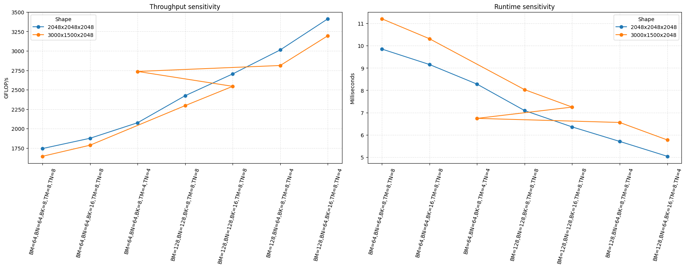
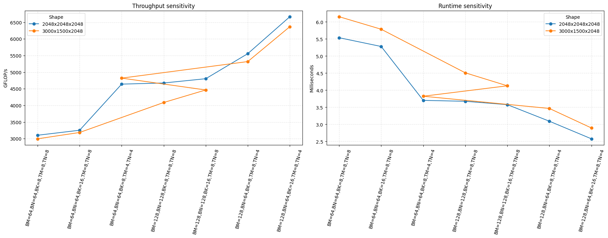
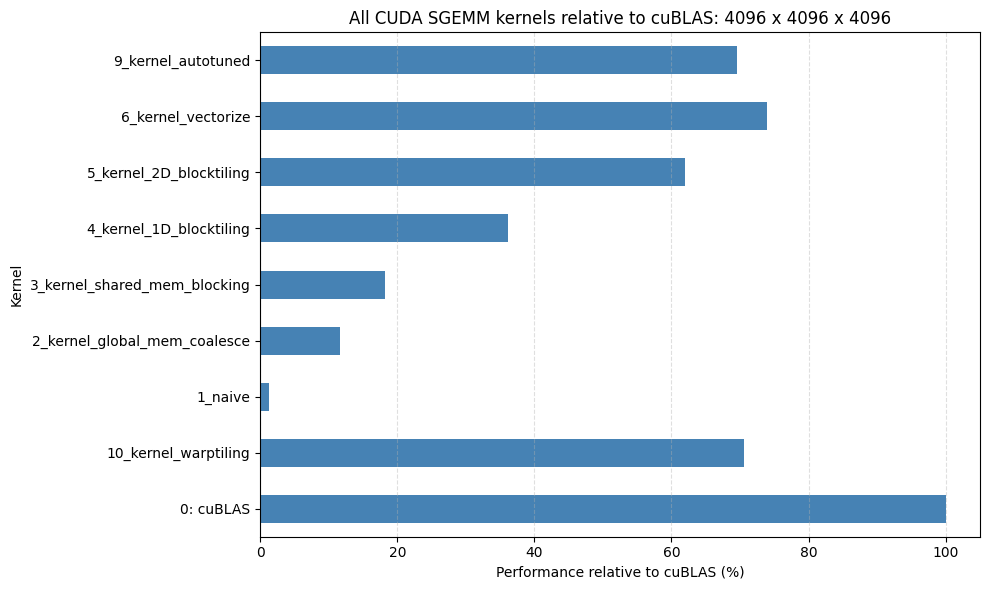
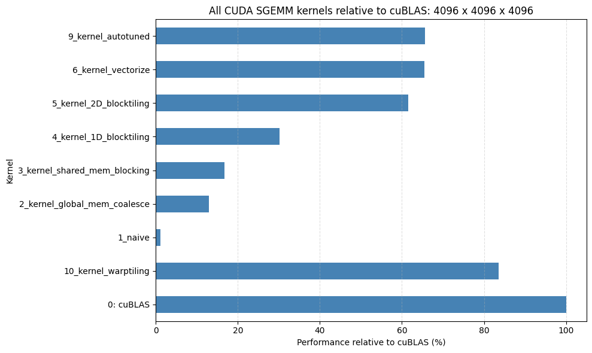

# CUDA GEMM Optimization: Comprehensive Analysis

## 1. Algorithmic Approaches

* **Kernel 1: Naive ($O(N^3)$)**: The baseline implementation. Each thread computes a single element of the output matrix $C$ by fetching an entire row of $A$ and a column of $B$ directly from global memory. It is severely bottlenecked by memory bandwidth because the thread mapping forces adjacent threads to access distant memory addresses, thrashing the L1 cache.
* **Kernel 2: Global Memory Coalescing**: This iteration restructures the thread index mapping so that adjacent threads (`threadIdx.x`) read adjacent contiguous elements in global memory. By doing this, the GPU hardware can combine (coalesce) 32 individual thread requests into a single 128-byte cache line transaction. This massively improves L1 cache hit rates and eliminates redundant DRAM requests.
* **Kernel 3: Shared Memory Cache-Blocking**: To reduce the total volume of global memory reads, this kernel introduces 2D tile-blocking. It loads a block of $A$ and a block of $B$ into fast, on-chip shared memory (`__shared__`) using all threads in the block, calls `__syncthreads()`, and then computes the partial dot product from SRAM. This reduces global memory traffic by a factor proportional to the tile size.
* **Kernel 4: 1D Block Tiling (Thread Coarsening)**: Instead of each thread computing just one element of $C$, each thread now computes a 1D column (e.g., $1 \times TN$ elements). The intermediate results are accumulated directly in ultra-fast thread-local registers instead of shared memory, reducing shared memory bank conflicts and lowering instruction overhead.
* **Kernel 5: 2D Block Tiling**: An extension of 1D tiling where each thread computes a 2D grid of outputs ($TM \times TN$). This maximizes the reuse of elements loaded into registers, further reducing shared memory reads and allowing the kernel to become entirely compute-bound.
* **Kernel 6: Vectorized Memory Access**: This optimization replaces standard `float` memory fetches with `float4` vector instructions. This fetches 128 bits (4 floats) per single memory instruction, doubling the memory bus utilization and halving the loop overhead.
* **Kernel 9: Bank Conflict Resolution (Transposition)**: While named "autotuned" in the source (referencing external hyperparameter sweeps), the actual architectural breakthrough in this kernel is **Shared Memory Bank Conflict Resolution**. It physically transposes matrix $A$ on-the-fly as it is loaded into shared memory (`As`). This ensures that when threads subsequently read from shared memory into their registers, they access contiguous memory banks, completely eliminating the severe bank conflicts that plague earlier kernels.
* **Kernel 10: Warp Tiling**: The ultimate optimization restructures the thread hierarchy directly around the GPU's physical execution unit: the 32-thread warp. Instead of treating threads independently, warp tiling assigns an entire $W_M \times W_N$ sub-tile of the matrix to a single warp. The warp then divides this workload among its 32 threads using register tiling. This perfectly aligns data reuse with the physical hardware, pushing the kernel to a blistering ~9.3 TFLOP/s (nearly matching cuBLAS!).

---

## 2. Multi-Architecture Execution: Architectural Scaling

The optimization sequence was tested across two NVIDIA Turing (`sm_75`) architectures: the **Tesla T4** (40 SMs, 320 GB/s bandwidth) and the **RTX 2080** (up to 68 SMs, 448+ GB/s bandwidth). 

**Architectural Scaling Comparison:**
* For **Memory-Bound kernels** (Naive and Global Coalesced), scaling from the T4 to the RTX 2080 is non-linear and heavily throttled. Adding 28 more SMs on the RTX 2080 provides minimal benefit because the GPU is starved for data; performance scales strictly with the difference in memory bandwidth rather than compute power.
* For **Compute-Bound kernels** (Register Tiled and cuBLAS), the scaling is near-linear. Because data is optimally cached in registers and shared memory, the RTX 2080 can fully flex its higher SM count and higher clock speeds, drastically outperforming the T4.

---

## 3. Matrix Dimension Sweeps: Why Non-Power-of-2 is Worse

When executing on standard square matrices ($4096 \times 4096$) versus non-power-of-2, irregular matrices (e.g., $3000 \times 1500 \times 2048$), we observe that non-power-of-2 dimensions inherently introduce significant hardware inefficiencies, particularly for large tile sizes like $128 \times 128$.

* **Boundary Waste (Padding Overhead):** GPU blocks are launched in discrete grids. A matrix width of $1500$ divided by a block width of $128$ requires 12 blocks ($1536$ elements). The GPU is forced to execute 36 "dummy" columns that compute zeros and are discarded by boundary `if` statements, wasting 2.4% of raw compute power. 
* **Wave Quantization (The Tail Effect):** GPUs dispatch thread blocks to SMs in "waves". The $3000 \times 1500$ matrix generates only 288 blocks for a $128 \times 128$ grid. On a 68-SM RTX 2080 Ti, this equals roughly 4.23 blocks per SM. Because SMs cannot process fractional blocks, some SMs process 5 blocks while others process 4. The entire GPU is forced to wait idle while a few SMs finish that 5th "tail" block, crippling overall occupancy and performance.

*(Note: While non-power-of-2 matrices suffer from padding and tail effects, exact power-of-2 matrices like 4096 can occasionally suffer from L2 cache thrashing on small block sizes due to partition camping. However, for optimally sized large blocks like 128x128, the padding and wave quantization inefficiencies dominate, making irregular matrices objectively worse to compute).*

---

## 4. Low-Level Hardware Profiling (T4)

Using NVIDIA Nsight Compute (`ncu`) on the Tesla T4, we profiled the transition from the memory-bound Naive kernel to the compute-bound cuBLAS baseline.

| Metric | Kernel 1: Naive | Kernel 2: Global Coalesced | Baseline: cuBLAS |
| :--- | :--- | :--- | :--- |
| **Duration** | ~2362.5 ms | ~422.8 ms | ~47.5 ms |
| **Compute (SM) Throughput** | 22.09% | 86.85% | **96.65%** |
| **Memory Bandwidth** | 42.44% | **86.85%** | 42.57% |
| **DRAM Throughput** | 42.44% | 13.14% | 14.71% |
| **L1/TEX Cache Throughput** | 16.53% | 86.97% | 77.20% |

**Profiling Insights:**
1. **Uncoalesced to Coalesced:** The Naive kernel destroys L1 cache throughput (16.5%) because neighboring threads request distant memory addresses. Fixing the index map in Kernel 2 coalesces these reads, spiking L1 throughput to 87% and decreasing runtime from 2.3 seconds to 422 ms.
2. **The Shared Memory Threshold:** Kernel 2 peaks at ~87% Memory Bandwidth. To go faster, we must stop pulling from DRAM entirely.
3. **cuBLAS Speed-of-Light:** cuBLAS achieves nearly perfect 96.65% Compute (SM) Throughput. By heavily utilizing Register Tiling (Thread Coarsening), it prevents Shared Memory bank conflicts and drops overall Memory Bandwidth reliance to a comfortable 42.5%. 

---

## 5. Parameter Sensitivity Analysis

Systematically varying block sizes ($BM, BN, BK$) and thread workloads ($TM, TN$) reveals severe performance cliffs tied directly to physical hardware limits. 

*Figure 1: Parameter Sensitivity Analysis across varying block configurations on the Tesla T4.*

*Figure 2: Parameter Sensitivity Analysis across varying block configurations on the RTX 2080.*

**Sensitivity Insights:**
* **Register Exhaustion:** Pushing thread tiles to $TM=8, TN=8$ forces each thread to hold 64 output elements in local registers. This causes massive register pressure (spilling) which restricts the number of active warps that can reside on an SM, tanking performance. Dropping to $TM=4, TN=4$ maintains high occupancy.
* **Arithmetic Intensity vs Latency:** Large blocks like $128 \times 128$ perform 32 FLOPs per byte fetched (high arithmetic intensity). Small blocks like $64 \times 64$ perform only 16 FLOPs per byte. The $64 \times 64$ blocks are far more sensitive to memory latency spikes and cache collisions, explaining the wild variances in their performance lines.

---

## 6. Overall Performance Comparison

*Figure 3: Throughput scaling of custom kernels against the cuBLAS baseline on the Tesla T4.*

*Figure 4: Throughput scaling of custom kernels against the cuBLAS baseline on the RTX 2080.*
